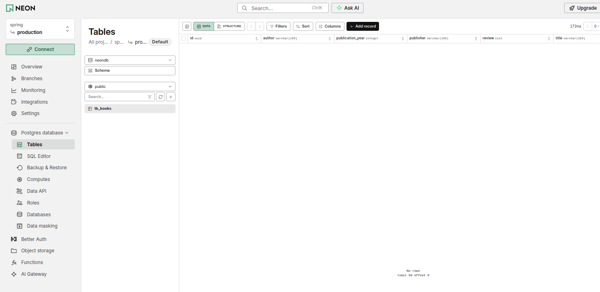

## Eu iniciei o spring boot com um video de 2022 de proposito e aqui eu vou te mostrar o porque
No meu repo spring-boot-mvc eu fiquei ate com dor no dedo de tanta pesquisa e digitação, erros de java antigo, foruns de reddit e ate um Q de stackoverflow eu me encontrei olhando; Agora esse é da mesma professora e é bem recente foi lançado faz 1 mês (18/08/2026) e como TODA internet ela não fez diferente, está usando IA (Veja bem eu não sou contra IA tenho ate amigos que são vibecoders, ja trabalhei em empresa vibecoder e sou obrigado a falar que aprendi muito com isso, os pós e contras... tem uns entusiastas/evangelizadores de IA né a maioria são e nem sabe; IA ACIMA DE TUDO, DEUS ACIMA DE TODOS é mais ou menos por ai) link da aula ta anexado ali no cantinho; cara eu to nos 15 minutos de aula e ja da pra perceber como a IA fez ela falar muito mas não falar quase nada ao mesmo tempo, se você for fazer uma comparação direta com o video de spring boot dela de 4 anos atrás a explicação foi muito mais com muito menos, teve foco, teve conceito, agora ela me chega com meio tonelada de slides bonitos (aqueles com cheiro de Claude Design) e mal conseguiu explicar coque é um Bean, nem mencionou IoC; Enfim... isso eu ja sei né kkk bom, breve desabafo sobre AI Slop. vamos seguir a aula
# Estão normalizando pagar para programar, e isso, é engraçado
Bom eu sempre fui acostumado a receber para programar kkk agora a senhorita, muito simpatica, inclusive, usa o claude code para programar esse "curso completo" de spring 2026... bom ja sei no que vai da, eu vou ficar assistindo a ia fazer o projeto inteiro, bom, vamos lá...

## O GRANDE IAAAAA também fez sua entrada triunfal

Eu só precisei mandar um prompt e o Codex foi útil pra achar o `urlXXX` que estava no lugar do endereço do Neon, acertar a conexão e rodar a aplicação com o Java 25. Olha o resultado: a tabela `tb_books` apareceu no banco.

Evidentemente, sem o GRANDE IAAAAA eu JAMAAAAAAAAAAIS conseguiria trocar uma URL, escolher o Java certo e conferir uma tabela no Neon. Ainda bem que ele apareceu para salvar a humanidade desse desafio impossível. kkk
